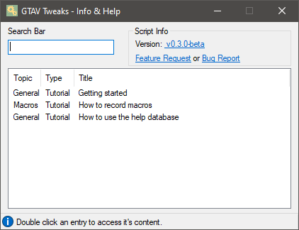
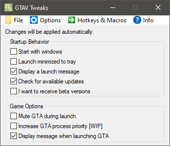
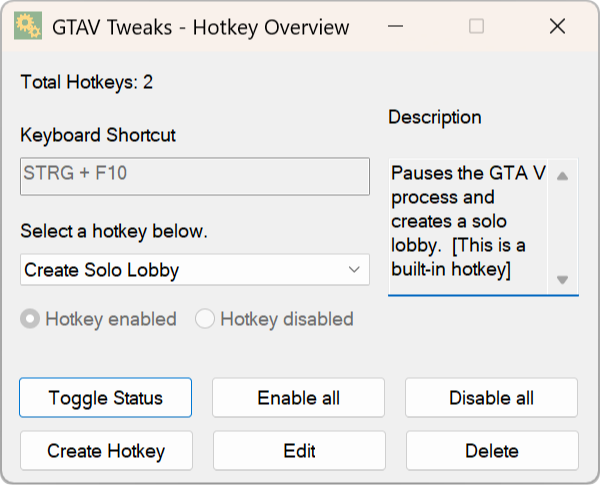
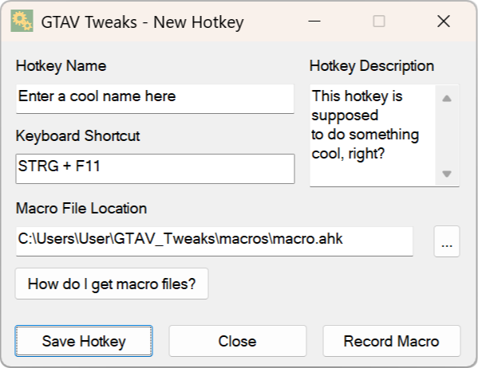

# **GTAV Tweaks**

 

**Hotkeys for GTA V Online**

This program adds **hotkeys** in combination with **macros** for GTA V Online. You can even create your **very own hotkeys**.

    

        
        
<em>Contains tutorials and further advice</em>

    

    

        
        
<em>This is the main window</em>

    

    

        
        
<em>Provides an overview over all hotkeys</em>

    

    

        
        
<em>You can create and edit hotkeys here</em>

    

## Installation

 

 

> All required files will be stored in the **GTAV_Tweaks** folder next to the **GTAV_Tweaks** executable. You can **uninstall** the program by simply deleting the files.

You can find all releases (including beta versions) **[here](https://github.com/LeoTN/gtav-tweaks/releases)**.

 

## Currently Available Built-in Hotkeys

| Hotkey     | Description                                                                                     |
|------------|-------------------------------------------------------------------------------------------------|
| CTRL + F9 | Holds down the W key and sends Numpad Up periodically. To stop it, simply press the key again.  |
| CTRL + F10 | Creates a GTA V Online solo lobby (as if you would do it with Task Manager).                    |

**You can change every hotkey in the config file or use the hotkey overview window.**

 

## Create Your Own Macros & Hotkeys

To make this possible, I also created a simple *macro recorder* in AutoHotkey.

You can **record** your **own macros** and execute them with a **keyboard shortcut of your choice**.

More information about this topic, including a FAQ section, can be found in the README file or the **help window**.

 

## Features

* Currently supported languages are **English** and **German**.

* It is possible to create **custom GTA V actions**, for instance calling NPCs on the phone, depositing cash into your bank account and so on. You can achieve this by creating **macros** and binding them to **hotkeys**.

* Ability to mute GTA V during launch and unmute it, once you start playing.

* Many customizable script startup options, for example an autostart feature or a silent launch.

 

## Credits & License

*  **NirSoft** ([source](https://www.nirsoft.net/utils/sound_volume_view.html)) for providing such an incredibly useful application.

I appreciate your **constructive** and **honest** feedback. Feel free to create an **issue** or **feature request**.

*This repository is licensed under the [MIT License](https://github.com/LeoTN/gtav-tweaks/blob/main/LICENSE).*